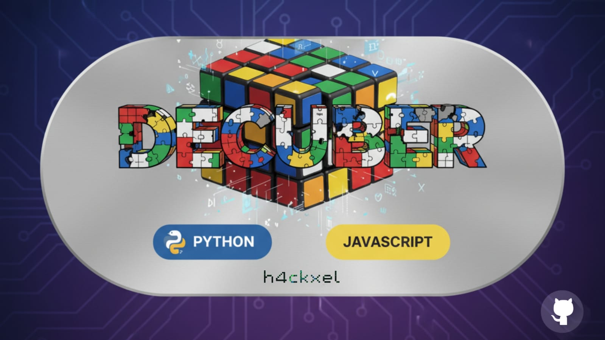
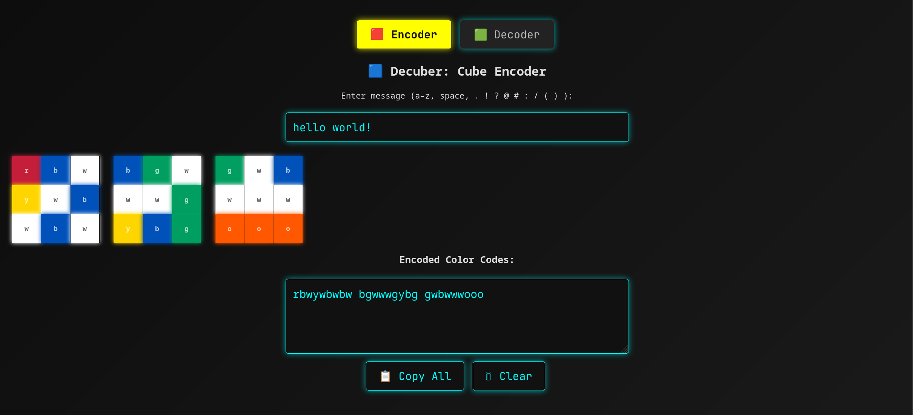

<div align="center">



[](https://h4cxel.github.io/Decuber)
[](https://www.python.org/)
[](LICENSE)
[](https://github.com/h4cxel/Decuber)

</div>

---

**Decuber** es una herramienta web para codificar mensajes en patrones de colores de un cubo de Rubik.

Puedes usarlo para:

* compartir mensajes secretos con amigos cuberos
* esconder *easter eggs* en fotos o videos
* añadir pistas en *escape rooms* o geocaching
* mandar felicitaciones nerd en cubos reales
* usarlo como reto en sesiones de speedcubing
* dejar notas ocultas en cubos de escritorio
* confundir gente por diversión 🤓

---

## 🔗 Demo en Vivo

👉 [Prueba Decuber aquí](https://h4cxel.github.io/Decuber)



---

## ⚠️ Qué Es / Qué No Es

✅ **Es**:

* Una forma divertida de codificar y decodificar mensajes usando 6 colores de cubo
* Un side project curioso inspirado en el cubing
* Útil para puzzles, geocaches, bromas y notas ocultas
* Un codificador visual simple

❌ **No es**:

* Un método de cifrado seguro
* Una herramienta seria de esteganografía
* Para proteger datos sensibles

---

## 🧠 Cómo Funciona

* Cada carácter se convierte en un **par de colores**.

* Como hay 6 colores estándar, tenemos `6 × 6 = 36` combinaciones → suficiente para:

  * 26 letras (`a–z`)
  * espacio
  * 9 caracteres especiales: `. ! ? @ # : / ( )`

* El cubo se representa en una **cara 3×3**:

  * El centro siempre es **blanco**
  * Los 8 campos alrededor se rellenan de arriba-izquierda a abajo-derecha
  * Cada 2 colores = 1 carácter
  * Una cara almacena **4 caracteres**

### 🧭 Convención de Orientación

* La cara de mensaje siempre tiene centro blanco
* El centro superior es verde
* (Pero puedes orientarlo como quieras)

---

## 🔄 CLI: Codificar Archivos, Texto o Streams

El script `DecubeBase36.py` extiende Decuber para manejar **cualquier dato binario** (texto, fotos, audios, ZIPs).

Cada byte se convierte a un alfabeto base36 → y de ahí a colores del cubo.

---

### 📦 Calcular Cubos Necesarios

```bash
./DecubeBase36.py -i demo.zip -s
```

Salida:

```
📦 File Summary:
- File size: 487 Bytes (3896 bits)
- Encoded length: 754 characters (Base36)
- Needed cubes: 189 (1 face per cube, 4 chars each)
```

---

### 🔐 Codificar un Archivo

```bash
./DecubeBase36.py -i demo.zip
```

➡️ Pega el resultado en el [Decuber visual encoder](https://h4cxkel.github.io/Decuber), arma tus cubos y compártelos.

---

### 🔓 Decodificar un Archivo

```bash
./DecubeBase36.py -d -i encoded.txt -o recovered.zip
```

---

### ⚙️ Otros Ejemplos

```bash
./DecubeBase36.py "hello world"      # codifica un string
./DecubeBase36.py -d "abcxyz123..."  # decodifica un string
cat file | ./DecubeBase36.py         # codifica desde stdin
echo "xyz..." | ./DecubeBase36.py -d # decodifica desde pipe
```

---

## 🛡 Uso con Cifrado (Opcional)

Puedes combinarlo con **OpenSSL** para mensajes seguros:

```bash
echo "mysecret" \
| openssl enc -aes-256-cbc -pbkdf2 \
| ./DecubeBase36.py
```

Salida ejemplo:

```
bb?kdvosq#dy?jlh#x@lztqzug@rgknyke:m!a#cl:ulfwzdj(
```

### 🔓 Decodificar + Desencriptar

```bash
./DecubeBase36.py -d 'bb?kdvosq#...' \
| openssl enc -d -aes-256-cbc -pbkdf2
```

---

## 📥 Requisitos

* Python 3.x
* Sin dependencias externas
* Funciona en Linux, macOS, WSL, etc.

Hazlo ejecutable:

```bash
chmod +x DecubeBase36.py
```

O ejecútalo con:

```bash
python3 DecubeBase36.py
```

---

## 🗺 Roadmap / Ideas Futuras

* Codificación optimizada para almacenar más de 4 caracteres por cara
* Soporte de emojis o sets de caracteres extendidos
* Codificación gráfica completa (guardar imágenes dentro de cubos)
* Generación automática de secuencias de scramble para reproducir mensajes

---

## 👋 Motivación

Una tarde de domingo, mientras practicaba speedcubing, me pregunté:
**“¿Podría esconder un mensaje dentro de un cubo de Rubik?”**

Pocas horas después nació Decuber: rápido, imperfecto, pero divertido.
Sí, sé que se puede optimizar mucho más — pero esa es la magia de un buen *side project*.

---

## 📜 Licencia

MIT License — úsalo, modifícalo y compártelo libremente.

---
